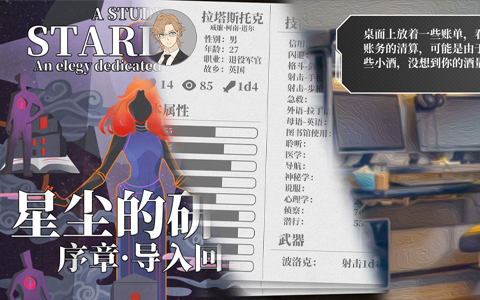
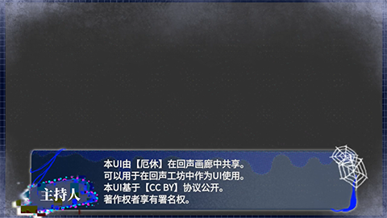
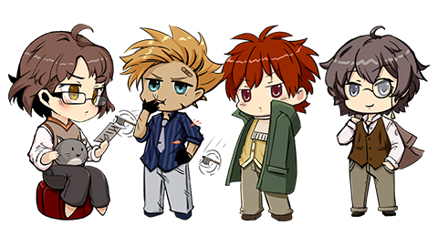
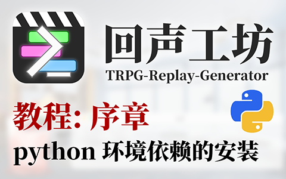
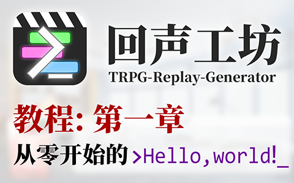
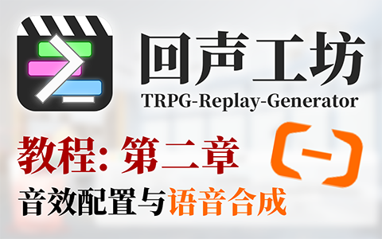
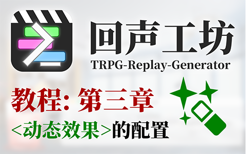

# 回声画廊

回声画廊 是 回声工坊 项目的的一个成果展示和素材共享平台。

你可以：
1. 浏览最新的，回声工坊的视频教程与更新动态，以及基于回声工坊创作的replay视频成品。
2. 获取由其他用户无偿提供的图片素材、UI设计以及示例项目，并应用到自己的工程里。
3. 共享自己的成果、创意或者模板，并开放给其他用户使用。

# 成品展览

### [星尘的研究](./gallery/A_Study_in_Stardust)

# 素材共享

## 界面区

### [MangHe_01](./share/MangHe_01/)

### [EXiu_01](./share/EXiu_01/)

## 立绘区

### [ShiChen_01](./share/ShiChen_01/)

# 视频教程

### [序章-python环境依赖的安装](https://www.bilibili.com/video/BV1Vu411e74H/)

### [第一章-从零开始的“Hello World!”](https://www.bilibili.com/video/BV1RP4y1K76f/)

### [第二章-音效配置与语音合成](https://www.bilibili.com/video/BV17i4y1D76s/)

### [第二章-音效配置与语音合成](https://www.bilibili.com/video/BV1Gi4y1U7Ck/)
