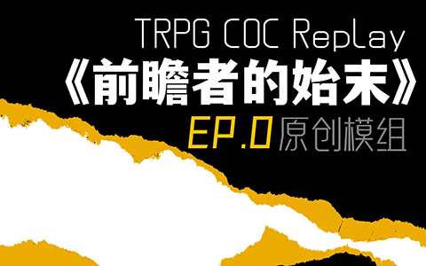

# 介绍

# 《前瞻者的始末》 COC TRPG Replay

“真相不是目的，生命不是代价，恐惧不是理由。”
“把眼光放长远些，朋友。”
“远一些，穿过那片密林。”
“直到我们终究在起点相会。”

[视频链接](https://www.bilibili.com/video/BV1cv4y1K79q/)

## 声明

1. 《前瞻者的始末》是基于COC TRPG 7版规则所编写的原创模组，隶属于“MZQ基金会·启明星篇”系列中。
2. 系列第一部预计50集内完结，每集10-15分钟。
3. 在内容方面，为保证观看体验，虽尽力保留了PC和NPC的大致角色定位，但还是对log进行了修改和删节。
4. 所以不要把这当做是我们桌跑团的真实水平

# 授权范围
视频仅在B站账号【Scaqh_Cat】发布，不要商用，转发请附注原视频连接or我的B站账号，二创摩多摩多TvT。
其他授权见视频内。

# 署名
**作者**：ScaqhCat（斯伽古·卡特）

**B站ID**：[Scaqh_Cat](https://space.bilibili.com/13661674)